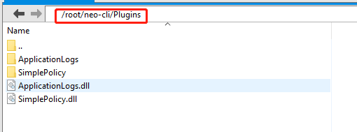

# Configuring and Starting Neo-CLI 

After installation of Neo-CLI, this section we will walk you through the necessary configurations before running Neo-CLI and the steps to start Neo-CLI using commands. 

## Modifying configuration files

Neo-CLI accesses two configuration files during execution: `config.json` and `protocol.json`. You need to make necessary configurations in these files before starting Neo-CLI. For  information about attributes of the files, refer to [Neo-CLI](../../tooldev/neo_cli_structure.md) structure. 

### Configuring a wallet

Before you can invoke the wallet related API, you need to configure a wallet in the config.json file to enable Neo-CLI to open the wallet automatically when running. 

- `MaxGasInvoke`: The maximum GAS amount allowed to be consumed when invoking virtual machine by RPC
- `Path`: the wallet path
- `Password`: the wallet password
- `IsActive`: Set to `true` to allow Neo-CLI to open the wallet automatically.

Here is an example:

```
  {
  "ApplicationConfiguration": {
    "Paths": {
      "Chain": "Chain_{0}",
      "Index": "Index_{0}"
    },
    "P2P": {
      "Port": 10333,
      "WsPort": 10334
    },
    "RPC": {
      "BindAddress": "127.0.0.1",
      "Port": 10332,
      "SslCert": "",
      "SslCertPassword": ""
    },
    "UnlockWallet": {
      "Path": "wallet.json",
      "Password": "11111111",
      "StartConsensus": false,
      "IsActive": true
    }
  }
}
```

> [!Note]
>
> The BindAddress option has been added to Neo-CLI 2.9.1, which defaults to local 127.0.0.1. You can set it to the ipv4 address of the specified NIC to allow RPC invoking. If no object is specified, it can be set to 0.0.0.0.

### Configuring HTTPS

If you want to access the RPC server via HTTPS, you need to set the domain name, certificate,  and password in config.json before starting the node, as shown below:

```json
{
  "ApplicationConfiguration": {
    "Paths": {
      "Chain": "Chain"
    },
    "P2P": {
      "Port": 10333,
      "WsPort": 10334
    },
    "RPC": {
      "Port": 10331,
      "SslCert": "YourSslCertFile.xxx",
      "SslCertPassword": "YourPassword"
    }
  ...
```

### Connecting the node to network

Neo-CLI connects to Neo main net by default. If you want to connect the node to test net, you need to replace the main net configuration files by the corresponding test net files (i.e. replace `config.json` and `protocol.json` under Neo-CLI root directory by `config.testnet.json` and `protocol.testnet.json`, respectively). For more information refer to [Main net and Test net](../../network/testnet.md).

If you want to connect the node to your private net, refer to [Setting up Private Chain](../../network/private-chain/solo.md) to modify the file `protocol.json`.

## Installing plugins

Since Neo 2.9.0 some additional functionalities are individually encapsulated in plug-ins for the purpose of improving node security, stability, and flexibility. The user can select the desired extension functionality instead of invoking it with additional parameters every time starting neo-cli, thus avoiding many human errors and some tedious instructions such as opening a wallet and calling applicationlogs. 

### Downloading plugins from GitHub

Download the plugins you need from the following table.

<table class="table table-hover">
    <thead>
        <tr>
            <th style="width: 25%;">Plugin</th>
            <th style="width: 35%;">Description</th>
            <th style="width: 20%;">API Included</th>
            <th style="width: 20%;"></th>
        </tr>
    </thead>
    <tbody>
        <tr>
            <td><a
                    href="https://github.com/neo-project/neo-plugins/releases/download/v2.10.3/ApplicationLogs.zip">ApplicationLogs</a>
            </td>
            <td>Synchronizes the smart contract log (ApplicationLogs) automatically in RPC mode. Currently the log has been changed to be stored in the format of LevelDB.</td>
            <td><a href="cli/latest-version/api/getapplicationlog.html">getapplicationlog</a></td>
            <td>Mandatory for exchanges</td>
        </tr>
        <tr>
            <td><a
                    href="https://github.com/neo-project/neo-plugins/releases/download/v2.10.3/ImportBlocks.zip">ImportBlocks</a>
            </td>
            <td>Synchronizes the client using offline packages.</td>
            <td></td>
            <td>Mandatory</td>
        </tr>
        <tr>
            <td><a
                    href="https://github.com/neo-project/neo-plugins/releases/download/v2.10.3/RpcWallet.zip">RpcWallet</a>
            </td>
            <td>Provides wallet-specific RPC functionalities.</td>
            <td><a href="../../reference/rpc/latest-version/api/claimgas.html">claimgas</a><br><a
                    href="../../reference/rpc/latest-version/api/dumpprivkey.html">dumpprivkey</a><br><a
                    href="../../reference/rpc/latest-version/api/getbalance.html">getbalance</a><br><a
                    href="../../reference/rpc/latest-version/api/getnewaddress.html">getnewaddress</a><br><a
                    href="../../reference/rpc/latest-version/api/getunclaimedgas.html">getunclaimedgas</a><br><a
                    href="../../reference/rpc/latest-version/api/getwalletheight.html">getwalletheight</a><br><a
                    href="../../reference/rpc/latest-version/api/importprivkey.html">importprivkey</a><br><a
                    href="../../reference/rpc/latest-version/api/listaddress.html">listaddress</a><br><a
                    href="../../reference/rpc/latest-version/api/sendfrom.html">sendfrom</a><br><a
                    href="../../reference/rpc/latest-version/api/sendmany.html">sendmany</a><br><a
                    href="../../reference/rpc/latest-version/api/sendtoaddress.html">sendtoaddress</a><br><a
                    href="../../reference/rpc/latest-version/api/invokefunction.html">invokefunction</a><br><a
                    href="../../reference/rpc/latest-version/api/invokescript.html">invokescript</a></td>
            <td>Mandatory</td>
        </tr>
        <tr>
            <td><a
                    href="https://github.com/neo-project/neo-plugins/releases/download/v2.10.3/SimplePolicy.zip">SimplePolicy</a>
            </td>
            <td>Enables policies for filtrate illegal transactions</td>
            <td></td>
            <td>Mandatory</td>
        </tr>
                <tr>
            <td><a
                    href="https://github.com/neo-project/neo-plugins/releases/download/v2.10.3/CoreMetrics.zip">CoreMetrics</a>
            </td>
            <td>Enquiries the timestamp of history blocks.</td>
            <td><a href="cli/latest-version/api/getmetricblocktimestamp.html">getmetricblocktimestamp</a></td>
            <td>Recommended</td>
        </tr>
        <tr>
            <td><a
                    href="https://github.com/neo-project/neo-plugins/releases/download/v2.10.3/RpcSystemAssetTracker.zip">RpcSystemAssetTracker</a>
            </td>
            <td>Enquiries the UTXO assets related information.</td>
            <td><a href="../../reference/rpc/latest-version/api/getmetricblocktimestamp.html">getunclaimed</a><br><a
                    href="../../reference/rpc/latest-version/api/getmetricblocktimestamp.html">getclaimable</a><br><a
                    href="../../reference/rpc/latest-version/api/getmetricblocktimestamp.html">getunspents</a></td>
            <td>Recommended</td>
        </tr>
                <tr>
            <td><a
                    href="https://github.com/neo-project/neo-plugins/releases/download/v2.10.3/RpcNep5Tracker.zip">RpcNep5Tracker</a>
            </td>
            <td>Enquiries NEP-5 balance and transactions history of accounts through RPC</td>
            <td><a href="../../reference/rpc/latest-version/api/getmetricblocktimestamp.html">getnep5balances</a><br><a
                    href="../../reference/rpc/latest-version/api/getmetricblocktimestamp.html">getnep5transfers</a></td>
            <td>Recommended</td>
        </tr>
                <tr>
            <td><a
                    href="https://github.com/neo-project/neo-plugins/releases/download/v2.10.3/RpcSecurity.zip">RpcSecurity</a>
            </td>
            <td>Enhances the security of RPC requests by enabling base64 encryption for HTTP requests. You need to configure the user name and password in the plugin config.json file.</td>
            <td></td>
            <td>Optional</td>
        </tr>
        <tr>
            <td><a
                    href="https://github.com/neo-project/neo-plugins/releases/download/v2.10.3/StatesDumper.zip">StatesDumper</a>
            </td>
            <td>Exports Neo-CLI status data.</td>
            <td></td>
            <td>Optional</td>
        </tr>
    </tbody>
</table>


To install plugins, unzip the package under the Neo-CLI root directory, as shown below. 



### Downloading plugins using command

For Neo-CLI 2.9.4 and later, it is easier to automatically install or uninstall the plugin using commands, for example:

```
install ImportBlocks
uninstall ApplicationLogs
```

After installation, restart Neo-CLI for the plugin to take effect.

## Synchronizing blockchain data

The client must be fully synchronized before use. In order to speed up network synchronization you can download an offline package of the blockchain data up to a certain block height.  This means the client will only need to sync the additional blocks from the Neo network rather than the entire blockchain. For more information,  see  [Synchronizing the blockchain faster](../syncblocks.md).

## Starting the Neo node

Open the command line, navigate to the Neo-CLI directory, and enter the following command to start the Neo node:

On **Windows 10**:

```
dotnet neo-cli.dll
```

or 

```
neo-cli.exe
```

On **Linux (ubuntu 17.10)**:

```
./neo-cli
```

or

```
dotnet neo-cli.dll
```

> [!Note]
>
> If you  use dotnet install .net core in advance.

Neo-CLI provides a series of APIs for external access. If you want to start the node while opening the API, you can add the parameter `--rpc`, `/rpc`, or `-r`, for example:

```
neo-cli.dll --rpc
```
If you want the external program to access the node API need to open the firewall port: 10331-10334, 20331-20334

> [!CAUTION]
>
> If you open the API service and the wallet in Neo-CLI, you need to set up your firewall policy. For example, set a whitelist for the firewall to only allow access to these ports by whitelisted IP addresses. If completely opening the service to external network, others may be able to export the private key or transfer assets using API.

## What's next?

[Neo-CLI SeedList](seedlist.md)