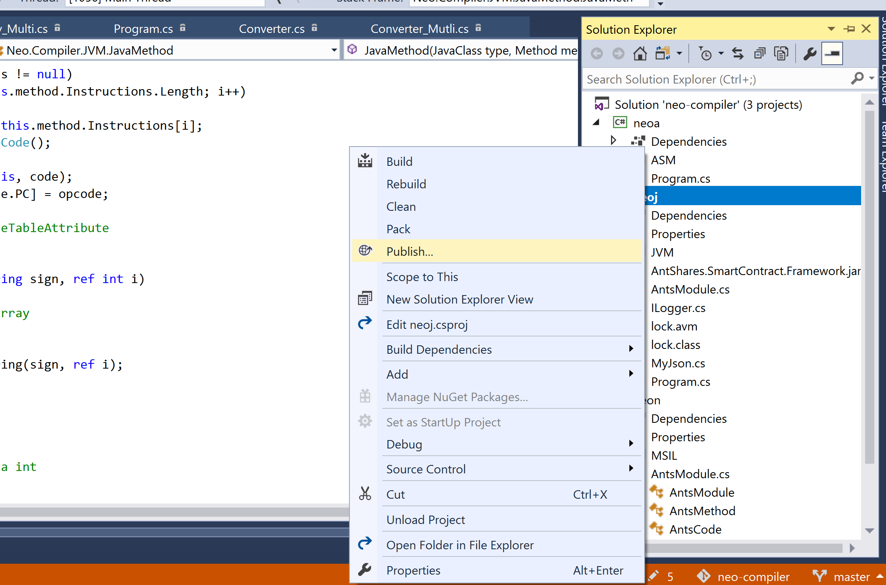
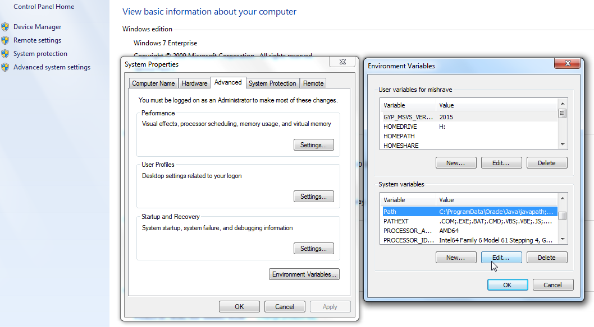
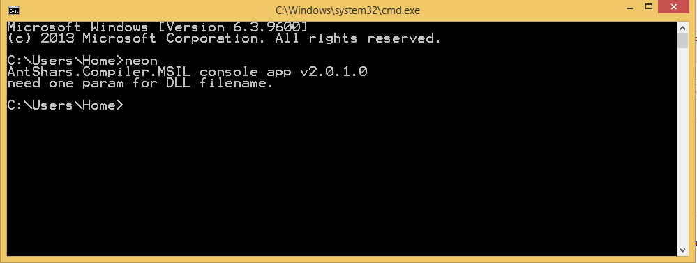
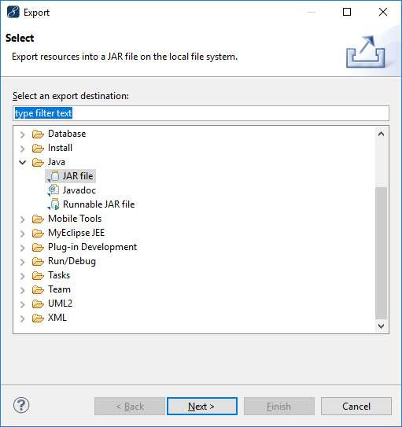
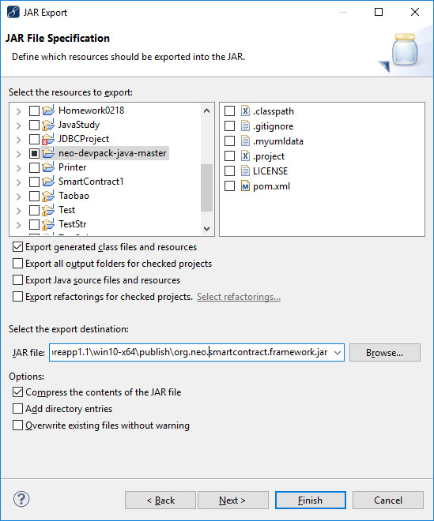

# How to use Java to write a Neo smart contract

This section contains a tutorial that guides you in configuring the Java development environment for Neo smart contracts. It also gives you an idea of how to create a smart contract project and how to compile it.

## Downloading tools

1. Download an IDE for Java (optional but recommended), e.g. IntelliJ or Eclipse.

2. (Windows only) Download an IDE for C#.

   Currently the neoj compiler needs to be built manually as it is not in wide distribution release format. Recommended is to get [Visual Studio 2019](https://visualstudio.microsoft.com/vs/community/) which is free. Note that you need to check the installation of `.NET Core cross-platform development`.

## Publishing neo-compiler

**Windows:**

1. Download the [neo-compiler](https://github.com/neo-project/neo-compiler) project on Github, open the solution neo-compiler.sln with Visual Studio 2019.

2. Publish the neoj compiler (which converts Java bytecode to the AVM bytecode) to the default path.

   After published successfully, neoj.exe is generated under that path.



**Linux and Mac OS:**

Since there's no "publish" function in Visual Studio Code for Linux or Mac OS we build it manually.

1. Make sure you have dotnet installed:

   [dotnet for Linux](https://docs.microsoft.com/en-us/dotnet/core/linux-prerequisites?tabs=netcore2x#install-net-core-for-ubuntu-1404-ubuntu-1604-ubuntu-1610--linux-mint-17-linux-mint-18-64-bit)

   [dotnet for Mac OS](https://docs.microsoft.com/en-us/dotnet/core/macos-prerequisites?tabs=netcore2x#supported-macos-versions)

2. Download the [neo-compiler](https://github.com/neo-project/neo-compiler) project on Github.

   ```
   cd neo-compiler/neoj
   dotnet build
   ```

   > [!Note] 
   >
   > At this point, after having launched the build command, you could get the following error:
   > `It was not possible to find any compatible framework version
   >  The specified framework 'Microsoft.NETCore.App', version '1.0.4' was not found.`If this is the case, open neoj.csproj and change the RuntimeFrameworkVersion's tag with your dotnet version. For example `<RuntimeFrameworkVersion>2.0.5</RuntimeFrameworkVersion>`

### Setting environment variables

We now need to add this directory to our execution path. The PATH is the system variable that your operating system uses to locate needed executables from the command line or Terminal window.

**Windows 10 and Windows 8:**

1. In Search, search for and then select: System (Control Panel)
2. Click the Advanced system settings link.
3. Click Environment Variables. In the section System Variables, find the PATH environment variable and select it. 
4. Click Edit. If the PATH environment variable does not exist, click New.
5. In the Edit System Variable (or New System Variable) window, specify the path where neoj.exe locates in. Click OK. 

**Windows 7:**

1.   From the desktop, right click the Computer icon.
2. Choose Properties from the context menu.
3. Click the Advanced system settings link.
4. Click Environment Variables. 
5. In the section System Variables, find the PATH environment variable and select it. Click Edit. If the PATH environment variable does not exist, click New.
6. In the Edit System Variable (or New System Variable) window, specify the path where neoj.exe locates in. Click OK. 



Now run Command or PowerShell, and enter neoj.exe. If there is no error and the output shows as shown below the environment variable configuration is successful.



> [!Note]
>
> Windows 7 SP1 users might encounter an error "Unhandled Exception: System.DllNotFoundException: Unable to load DLL 'api-ms-win-core-console-l2-1-0.dll': The specified module could not be found". The required 'api-ms-win-core-console-l2-1-0.dll' file is only found in Windows 8 or later versions. This error can be resolved by obtaining a copy of 'api-ms-win-core-console-l2-1-0.dll' and putting it in the directory C:\Windows\System32. This dll can potentially be found in a number of places throughout one's system(search your computer and copy/past it into \System32), but alternatively can be found online.

**Linux**

Add this to your ~/.profile or ~/.bashrc file:

`export PATH=$PATH:/path/to/neo-compiler`

then execute `source ~/.profile` or `source ~/.bashrc`

## Creating java project

After the above installation is complete you can create a Java project (e.g. using Eclipse or IntelliJ).

1. Compile the .jar package of smart contract from the neo java devpack project ([neo-devpack-java](https://github.com/neo-project/neo-devpack-java)) and add it as an external library.

2. Export the package of `org.neo.smartcontract.framework` as the .jar package `org.neo.smartcontract.framework.jar` 

   

3. In the dialog that appears select `Java`->`JAR file`->`Next`.

   
   
4. Put the package under the directory ..\neoj\bin\Release\netcoreapp1.1\win10-x64\publish\

   

5. Create another project, and import org.neo.smartcontract.framework.jar we got in last step. 

6. Create a class, e.g. go.java, and paste the following code into the class file.

   ```java
   import org.neo.smartcontract.framework.SmartContract;
   
   public class Go extends SmartContract{
   	public static void Main(byte[] signature)
   	{
   		
   	}
   }
   ```

7. In eclipse click `Project`->`Build Project` compile go.java into go.class. The output file is under bin directory.

   

8. Alternatively, you can build from the command line in Mac OS:

   `cd /path/to/HelloWorld/project`

   `javac -cp /path/to/org.neo.smartcontract.framework.jar go.java`

## Transforming go.class to go.avm

**Windows:**

Then using neoj, run cmd.exe and execute:

`neoj.exe go.class`

**Linux:**

Copy the jar into the dotnet's folder. For example:

`sudo cp org.neo.smartcontract.framework.jar /usr/share/dotnet`

and then call

`dotnet run go.class`

**Mac OS:**

Copy the jar to the neo-compiler's neoj folder. For example:

`sudo cp org.neo.smartcontract.framework.jar /path/to/neo-compiler/neoj`

Also copy HelloWorld.class to the neoj folder. For example:
`sudo cp go.class /path/to/neo-compiler/neoj`

Then from the neoj folder call

`dotnet run go.class`


If successful, it will create go.avm which you can now use as smart contract bytecode.

## What's next?

Once you are at this stage, the instructions are the same no matter what language you used to write the smart contracts. Follow this tutorial: [Deploying a smart contract](../deploy/deploy.md)